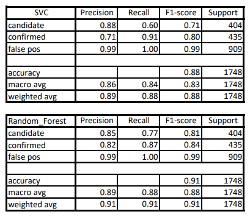

# Machine Learning Homework - Exoplanet Exploration

## Background

Over a period of nine years in deep space, the NASA Kepler space telescope has been out on a planet-hunting mission to discover hidden planets outside of our solar system.

To help process this data, I have created machine learning models capable of classifying candidate exoplanets from the raw dataset.

In this homework assignment, I had to:

1. [Preprocess the raw data](#Preprocessing)
2. [Tune the models](#Tune-Model-Parameters)
3. [Compare two or more models](#Evaluate-Model-Performance)

- - -
## Parameters and Requirements that were followed

### Preprocess the Data

* Preprocess the dataset prior to fitting the model.
* Perform feature selection and remove unnecessary features.
* Use `MinMaxScaler` to scale the numerical data.
* Separate the data into training and testing data.

### Tune Model Parameters

* Use `GridSearch` to tune model parameters.
* Tune and compare at least two different classifiers.

### Reporting

* Create a README that reports a comparison of each model's performance as well as a summary about your findings and any assumptions you can make based on your model (is your model good enough to predict new exoplanets? Why or why not? What would make your model be better at predicting new exoplanets?).

- - -

## Models used and Conclusions

The first model used was the Support Vector Machine Linear Classifier by way of the sklearn.svm and importing SVC. The second model used was the Random Forest Classifier by way of sklearn.ensemble and importing the RandomForestClassifier.

The comparison by using the Classification_report image below

The RF model had a grid best score of 89% and the SVC model had a grid best score of 87%. By the values found by the classification report and the grid's best scores, I belive the Random Forest model was the best.
